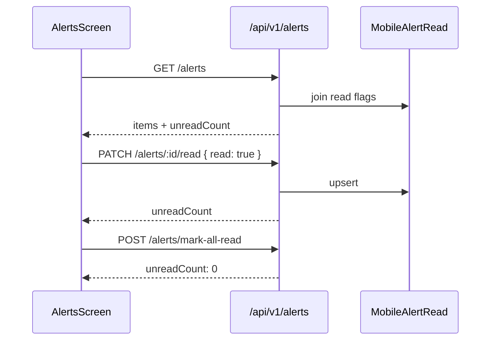

# Mobile integration plan — Alerts tab

**Audience:** React Native app (`AlertsScreen`, tab badge, Home alert preview)  
**Backend:** `/api/v1/alerts/*` (implemented)  
**Related:** [mobile-api-v1-dashboard.md](./mobile-api-v1-dashboard.md), [Home tab](./mobile-integration-home-tab.md)

---

## 1. Goal

Replace `MOCK_ALERTS` and local-only read state with **server-backed alerts** for the user’s profile address and alert locations, including **read/unread** persisted per user.

---

## 2. Prerequisites

| Requirement | Why |
|-------------|-----|
| Bearer `accessToken` | All alert routes require auth |
| `profileComplete` + address | Zone matching uses geocoded address |
| Optional `alertLocations` | Extra zones via [Profile tab](./mobile-integration-profile-tab.md) `PUT /profile/alert-locations` |

Alerts are matched from:

- NWS / `WeatherAlertRecord` (ingested)
- USGS earthquakes (live, near zones)
- `CommunityAlert` (broadcast or area overlap)

---

## 3. APIs

| Method | Path | Purpose |
|--------|------|---------|
| GET | `/alerts` | Main list (paginated, filterable) |
| GET | `/alerts/:id` | Single alert (detail / deep link) |
| PATCH | `/alerts/:id/read` | Mark one read/unread |
| POST | `/alerts/mark-all-read` | Mark all read |
| GET | `/alerts/unread-count` | Tab badge only (lightweight) |

### `GET /alerts` query

| Param | Values | Default |
|-------|--------|---------|
| `sort` | `recent` \| `severity` | `recent` |
| `severity` | `LOW` \| `MODERATE` \| `HIGH` \| `EXTREME` | — |
| `read` | `true` \| `false` | — |
| `q` | string | Search title/location/description |
| `page` | number | `1` |
| `limit` | number | `20` |

### Response shape

```json
{
  "items": [
    {
      "id": "urn:oid:...",
      "severity": "MODERATE",
      "title": "Flood Watch",
      "location": "CHEYENNE RIVER ABOVE ANGOSTURA...",
      "source": "NWPS",
      "issuedAt": "2026-05-23T14:00:00.000Z",
      "expiresAt": "2026-05-24T06:00:00.000Z",
      "expiresLabel": "EXPIRES: SEE GAUGE / NWPS",
      "read": false,
      "description": "..."
    }
  ],
  "page": 1,
  "limit": 20,
  "total": 3,
  "hasMore": false,
  "unreadCount": 2
}
```

**Note:** `unreadCount` is total unread **before** `read`/`severity` filters are applied to the list (use for badge). After filtering by `read=false`, `items.length` may differ.

---

## 4. UI mapping (`AlertsScreen` / `AlertCard`)

Align with `src/types/emergency.ts` or `dashboard.ts` `WeatherAlert` if already defined.

| API field | UI | Transform |
|-----------|-----|-----------|
| `id` | Key, navigation | stable |
| `severity` | Chip color | `LOW`→muted, `MODERATE`→amber, `HIGH`/`EXTREME`→red |
| `title` | Primary text | — |
| `location` | Secondary line | — |
| `source` | Small badge (`NWPS`, `USGS`, `COMMUNITY`) | — |
| `issuedAt` | “Issued 12 min ago” | **Client only:** `formatDistanceToNow(issuedAt)` |
| `expiresAt` / `expiresLabel` | Footer | Prefer `expiresLabel` when present |
| `read` | Bold vs muted, unread dot | — |
| `description` | Detail modal / expanded row | `GET /alerts/:id` if list omits body |

### Filters (screen controls)

| UI control | API param |
|------------|-----------|
| Sort: Recent | `sort=recent` |
| Sort: Severity | `sort=severity` |
| Severity filter chips | `severity=HIGH` etc. |
| Unread only | `read=false` |
| Search box | `q=...` (debounce 300ms) |

### Pagination

| UI | API |
|----|-----|
| Initial load | `page=1&limit=20` |
| Infinite scroll / Load more | `page++` while `hasMore` |

Append `items` to list state; do not replace unless refresh.

---

## 5. Read / unread flows



| Action | API | Local state |
|--------|-----|-------------|
| Open alert / swipe read | `PATCH .../read` `{ read: true }` | Update item `read`, set badge from `unreadCount` |
| Mark all read (header) | `POST /alerts/mark-all-read` | Set all `read: true`, badge `0` |
| Tab badge poll | `GET /alerts/unread-count` or Home badges | `setUnreadCount(n)` |

**Remove:** `markAlertRead` / `markAllAlertsRead` reducers that only touch local state.

---

## 6. TypeScript types (app)

**File:** `src/types/alerts.ts` (mirror `lib/types/mobile/alerts.ts`)

```typescript
export type MobileAlertSeverity = 'LOW' | 'MODERATE' | 'HIGH' | 'EXTREME';

export type MobileWeatherAlert = {
  id: string;
  severity: MobileAlertSeverity;
  title: string;
  location: string;
  source: string;
  issuedAt: string;
  expiresAt?: string;
  expiresLabel: string;
  read: boolean;
  description?: string;
};

export type AlertsListResponse = {
  items: MobileWeatherAlert[];
  page: number;
  limit: number;
  total: number;
  hasMore: boolean;
  unreadCount: number;
};
```

---

## 7. Service layer

**File:** `src/services/alerts.service.ts`

```typescript
export type AlertsQuery = {
  sort?: 'recent' | 'severity';
  severity?: MobileAlertSeverity;
  read?: boolean;
  q?: string;
  page?: number;
  limit?: number;
};

export async function listAlerts(token: string, query?: AlertsQuery) {
  const params = new URLSearchParams();
  // set each defined query field...
  return apiV1<AlertsListResponse>(`/alerts?${params}`, { token });
}

export async function getAlert(token: string, id: string) {
  return apiV1<MobileWeatherAlert>(`/alerts/${encodeURIComponent(id)}`, { token });
}

export async function markAlertRead(token: string, id: string, read = true) {
  return apiV1<{ message: string; unreadCount: number }>(
    `/alerts/${encodeURIComponent(id)}/read`,
    { method: 'PATCH', token, body: JSON.stringify({ read }) },
  );
}

export async function markAllAlertsRead(token: string) {
  return apiV1<{ message: string; unreadCount: number }>('/alerts/mark-all-read', {
    method: 'POST',
    token,
  });
}

export async function getUnreadCount(token: string) {
  return apiV1<{ unreadCount: number }>('/alerts/unread-count', { token });
}
```

---

## 8. Redux / state

**Slice:** `alertsSlice`

| State | Description |
|-------|-------------|
| `items` | Current page(s) of alerts |
| `page`, `hasMore`, `total` | Pagination |
| `unreadCount` | Tab badge |
| `filters` | `sort`, `severity`, `read`, `q` |
| `loading`, `loadingMore`, `error` | UI flags |

**Thunks:**

- `fetchAlerts` — page 1, replace items
- `fetchMoreAlerts` — next page, append
- `markRead(alertId)` — PATCH then patch item + unreadCount
- `markAllRead` — POST then clear unread styling
- `fetchUnreadCount` — optional poll

**Sync with Home:** when `fetchHome` completes, `dispatch(setUnreadCount(home.badges.unreadAlerts))`.

---

## 9. Tab bar badge

| Strategy | Pros |
|----------|------|
| From `GET /dashboard/home` after Home load | No extra request |
| `GET /alerts/unread-count` every 60s | Accurate when user stays on other tabs |
| From `GET /alerts` response `unreadCount` | Updated on each list fetch |

Recommended: Home sets initial badge; Alerts tab refresh + `markRead` updates; background poll `unread-count` optional.

---

## 10. Deep link / detail

Future “Take action” screen:

1. Navigate with `alertId`
2. `GET /alerts/:id`
3. Show `description`, `instructions` if you add later, `expiresLabel`

404 `ALERT_NOT_FOUND` → go back + toast.

---

## 11. Error handling

| Code | UX |
|------|-----|
| `ALERT_NOT_FOUND` | Remove from list if deleted/expired |
| 401 | Re-auth |
| Empty `items` | Empty state “No alerts for your locations” + link to add alert locations in Profile |

---

## 12. Home tab overlap

| Home uses | Alerts tab uses |
|-----------|-----------------|
| `home.recentAlerts` (2 items) | Full `GET /alerts` |
| Same `MobileWeatherAlert` shape | Same card component recommended |

Optional: tapping Home preview switches to Alerts tab with `id` highlighted — no separate API.

---

## 13. Testing checklist

- [ ] List loads with profile address
- [ ] Adding alert location in Profile changes list after refresh
- [ ] `PATCH read` persists after app restart
- [ ] `mark-all-read` sets badge to 0
- [ ] Pagination `hasMore` works
- [ ] Search `q` filters results
- [ ] Severity filter matches API param

```bash
curl -H "Authorization: Bearer TOKEN" "http://localhost:3000/api/v1/alerts?sort=recent&limit=20"
curl -X PATCH -H "Authorization: Bearer TOKEN" -H "Content-Type: application/json" \
  -d '{"read":true}' "http://localhost:3000/api/v1/alerts/ALERT_ID/read"
```

---

## 14. Implementation order

1. Types + `alerts.service.ts`
2. `fetchAlerts` + list UI
3. `issuedAt` formatter (client)
4. `markRead` + `markAllRead`
5. Tab badge sync
6. Pagination + filters + search
7. `GET /alerts/:id` detail (optional)
