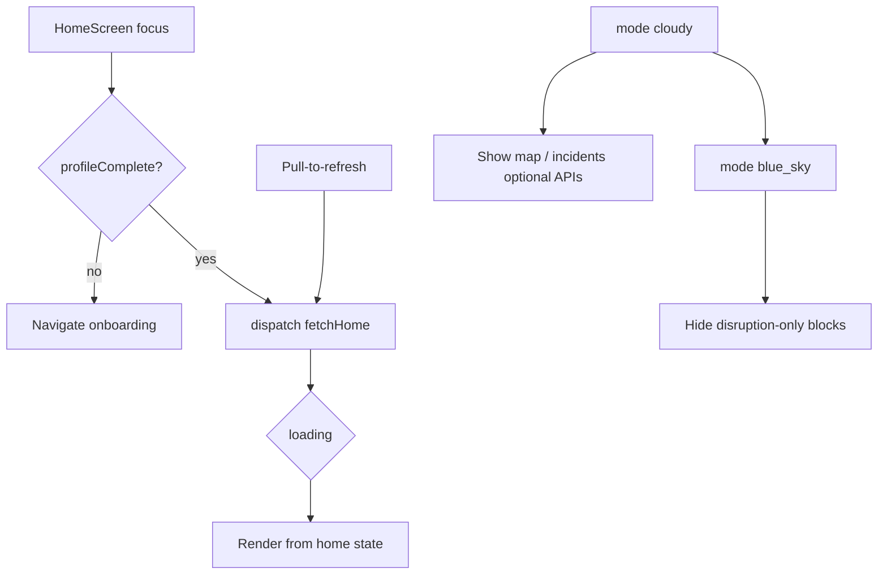

# Mobile integration plan — Home tab

**Audience:** React Native app (`HomeScreen`, tab bar badge)  
**Backend:** `/api/v1` (implemented)  
**Related:** [mobile-api-v1.md](./mobile-api-v1.md) (auth), [mobile-api-v1-dashboard.md](./mobile-api-v1-dashboard.md) (API reference)

Other tab plans:

- [Alerts tab](./mobile-integration-alerts-tab.md)
- [Profile tab](./mobile-integration-profile-tab.md)
- [Preparedness tab](./mobile-integration-preparedness-tab.md)

---

## 1. Goal

Replace Home mocks (`loadEmergencyDashboard`, `MOCK_WEATHER`, `MOCK_ALERTS` slice, static preparedness constants) with **one primary API** on load and pull-to-refresh, plus optional granular endpoints later.

---

## 2. Prerequisites

| Requirement | Why |
|-------------|-----|
| User logged in with valid `accessToken` | All routes require Bearer auth |
| `user.profileComplete === true` | Weather and alerts need profile address |
| `EXPO_PUBLIC_API_BASE_URL` set | e.g. `http://192.168.x.x:3000/api/v1` on device |
| Onboarding uses `POST /profile/complete` | Not Profile tab PATCH |

Cold start: after auth, call `GET /users/me` → if `profileComplete`, then load Home.

---

## 3. APIs for Home tab

### Primary (use this first)

| Method | Path | When |
|--------|------|------|
| GET | `/dashboard/home` | Screen mount, pull-to-refresh, return to Home tab |

**Query parameters (optional):**

| Param | Default | Purpose |
|-------|---------|---------|
| `include` | all sections | Comma list: `status,news,weather,alerts,preparedness` — omit sections to speed up dev |
| `newsLimit` | `4` | News feed row count |
| `alertsLimit` | `2` | “Active Alerts” preview count |

**Example:**

```http
GET /api/v1/dashboard/home?newsLimit=4&alertsLimit=2
Authorization: Bearer <accessToken>
```

### Secondary (optional)

| Method | Path | When |
|--------|------|------|
| GET | `/dashboard/badges` | Tab bar poll every 60s without full home payload |
| GET | `/weather/current` | Refresh only weather card if home weather is null |
| GET | `/emergency/status` | If you split banner logic from home (usually not needed) |
| GET | `/emergency/map` | Map block when `mode === 'cloudy'` |
| GET | `/emergency/incidents` | Incident log when `mode === 'cloudy'` |
| GET | `/emergency/news` | Full news screen (paginated) |

---

## 4. Response → UI mapping

### `mode` (banner)

| API value | UI component | Remove in production |
|-----------|--------------|----------------------|
| `blue_sky` | `BlueSkyStatusBanner` | `disruptionModeOverride` |
| `cloudy` | `DisruptionStatusBanner` | client-only override |

Server rule: `cloudy` when user has any **HIGH** or **EXTREME** alert in registered zones.

### `status` (banner text)

| Field | UI |
|-------|-----|
| `headline` | Banner title |
| `summary` | Banner subtitle |
| `severity` | Badge color (`LOW` / `MODERATE` / `HIGH` / `EXTREME`) |
| `updatedAt` | “Updated …” (format client-side) |

### `news` (feed)

| Field | UI |
|-------|-----|
| `title` | Card title |
| `body` | Card body |
| `timestamp` | Relative time |
| `location` | Subtitle / meta |
| `icon` | Ionicons name (string from API) |
| `source` | `emergency` \| `community` — optional styling |

Tap row → navigate to `EmergencyNewsScreen` or alert detail if you map `id` to `GET /alerts/:id`.

### `weather` (weather card)

| Field | UI (`WeatherSummaryCard`) |
|-------|---------------------------|
| `temperatureF` | Current temp |
| `condition` | Label |
| `highF` / `lowF` | Hi/lo |
| `humidity` / `windMph` | Details row |
| `locationLabel` | e.g. `Springfield, IL 62704` |

If `weather` is `null`, show “Complete your address in Profile” or call `GET /weather/current`.

### `recentAlerts` (Active Alerts preview)

Same shape as Alerts tab (`MobileWeatherAlert`). Map:

| Field | UI |
|-------|-----|
| `title` | Alert title |
| `severity` | Color chip |
| `location` | Subtitle |
| `issuedAt` | **Client:** `formatIssuedAgo(issuedAt)` — do not expect `issuedAgo` from API |
| `read` | Optional dot / styling |

Tap → Alerts tab or `GET /alerts/:id` detail.

### `preparednessCategories` (grid preview)

| Field | UI |
|-------|-----|
| `id` | Navigate to `PreparednessCategoryScreen` |
| `title` / `subtitle` / `icon` | Card content |
| `taskCount` | Badge “6 tasks” |

Usually top 4 from API; “See all” → Preparedness tab.

### `badges.unreadAlerts`

| Consumer | Usage |
|----------|--------|
| Home (optional) | Show chip “2 unread” |
| **DashboardTabBar** | Alerts tab badge number |

Prefer `home.badges.unreadAlerts` after each home fetch; optional poll `GET /dashboard/badges` or [Alerts tab plan](./mobile-integration-alerts-tab.md) `GET /alerts/unread-count`.

---

## 5. TypeScript types (app)

Copy or mirror from backend `lib/types/mobile/dashboard.ts`, `alerts.ts`, `preparedness.ts`, `weather.ts`:

```typescript
export type DashboardMode = 'blue_sky' | 'cloudy';

export type DashboardHomeResponse = {
  mode: DashboardMode;
  status: {
    headline: string;
    summary: string;
    severity: 'LOW' | 'MODERATE' | 'HIGH' | 'EXTREME';
    updatedAt: string;
  };
  news: Array<{
    id: string;
    title: string;
    body: string;
    timestamp: string;
    source: string;
    severity: string;
    category: string;
    location: string;
    icon: string;
  }>;
  weather: {
    temperatureF: number;
    condition: string;
    highF: number;
    lowF: number;
    humidity: number;
    windMph: number;
    locationLabel: string;
  } | null;
  recentAlerts: MobileWeatherAlert[];
  preparednessCategories: MobilePreparednessCategory[];
  badges: { unreadAlerts: number };
};
```

---

## 6. Service layer

**File:** `src/services/dashboard.service.ts`

```typescript
import { apiV1 } from './api-client';
import type { DashboardHomeResponse } from '@/types/dashboard';

export type HomeQuery = {
  include?: string[];
  newsLimit?: number;
  alertsLimit?: number;
};

export async function getHome(token: string, query?: HomeQuery): Promise<DashboardHomeResponse> {
  const params = new URLSearchParams();
  if (query?.include?.length) params.set('include', query.include.join(','));
  if (query?.newsLimit != null) params.set('newsLimit', String(query.newsLimit));
  if (query?.alertsLimit != null) params.set('alertsLimit', String(query.alertsLimit));
  const qs = params.toString();
  return apiV1<DashboardHomeResponse>(`/dashboard/home${qs ? `?${qs}` : ''}`, { token });
}

export async function getBadges(token: string): Promise<{ unreadAlerts: number }> {
  return apiV1('/dashboard/badges', { token });
}
```

---

## 7. Redux / state

**Slice:** `dashboardSlice` (or extend existing emergency dashboard slice)

| State field | Source |
|-------------|--------|
| `home` | `DashboardHomeResponse \| null` |
| `loading` | thunk pending |
| `error` | thunk rejected |
| `lastFetchedAt` | optional cache TTL |

**Thunk:** `fetchHome`

```typescript
export const fetchHome = createAsyncThunk(
  'dashboard/fetchHome',
  async (_, { getState }) => {
    const token = selectAccessToken(getState());
    return getHome(token, { newsLimit: 4, alertsLimit: 2 });
  },
);
```

**Extra reducers:** on fulfilled → set `home`, dispatch `setAlertsUnreadCount(home.badges.unreadAlerts)` for tab bar.

---

## 8. HomeScreen lifecycle



| Event | Action |
|-------|--------|
| `useFocusEffect` / mount | `fetchHome()` if stale or no data |
| Pull-to-refresh | `fetchHome()` |
| App foreground | Optional refresh if `lastFetchedAt` > 5 min |
| Logout | Clear `home` state |

---

## 9. Search (client-side)

Home search that filters news / alerts preview: **filter cached `home.news` and `home.recentAlerts` in memory** — no dedicated search API for Home in v1.

---

## 10. Error handling

| HTTP / `code` | UX |
|---------------|-----|
| 401 | Refresh token → retry once → login |
| 403 `FORBIDDEN` | Not a mobile account |
| 500 | Full-screen retry on Home |
| `weather === null` | Card placeholder + link to Profile |
| Empty `recentAlerts` | “No active alerts” empty state |

---

## 11. Remove / replace (checklist)

- [ ] Remove `disruptionModeOverride` (production)
- [ ] Remove `MOCK_WEATHER` for Home card
- [ ] Remove mock alert slice for Home preview
- [ ] Remove static preparedness constants for Home grid preview
- [ ] Wire `BlueSkyStatusBanner` / `DisruptionStatusBanner` to `home.mode` + `home.status`
- [ ] Wire `WeatherSummaryCard` to `home.weather`
- [ ] Wire news list to `home.news`
- [ ] Wire Active Alerts to `home.recentAlerts`
- [ ] Sync tab badge from `home.badges.unreadAlerts`

---

## 12. Testing

1. Login → complete profile with US address.
2. `GET /dashboard/home` returns 200 with all sections.
3. Pull-to-refresh updates timestamps.
4. With active NWS alerts in area, `mode` becomes `cloudy`.
5. Tab badge matches unread alerts (cross-check [Alerts tab plan](./mobile-integration-alerts-tab.md)).

```bash
curl -H "Authorization: Bearer TOKEN" "http://localhost:3000/api/v1/dashboard/home?alertsLimit=2"
```

---

## 13. Implementation order (Home only)

1. `api-client` + `dashboard.service.ts`
2. Types + `fetchHome` thunk
3. Banner + status from `home.mode` / `home.status`
4. Weather + recent alerts + news
5. Preparedness preview + badge sync
6. Optional: map/incidents when `cloudy` (P4 emergency routes)
